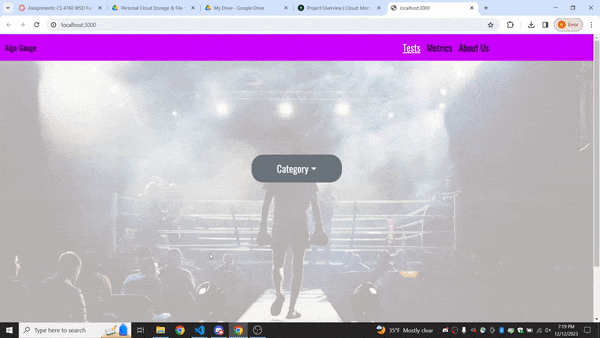
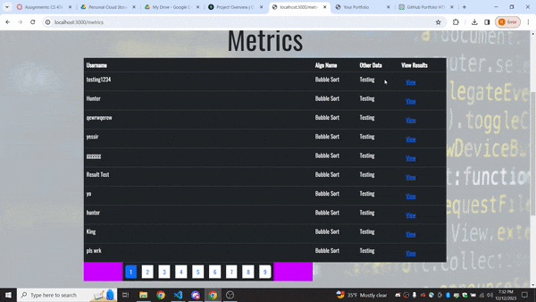
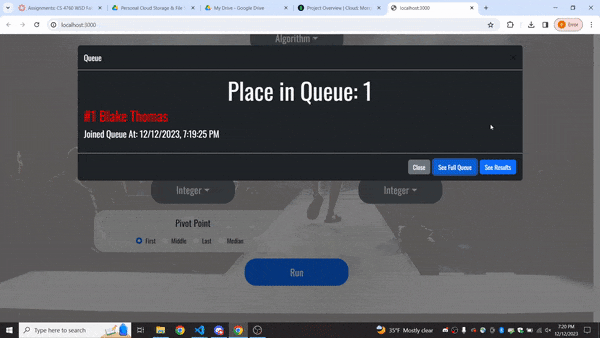
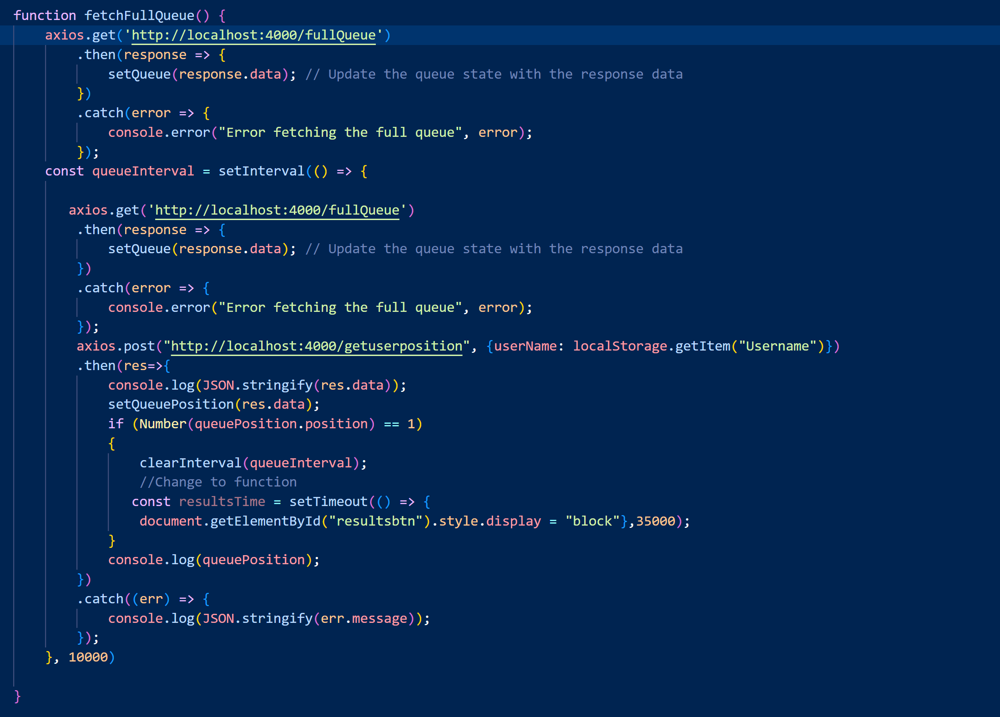
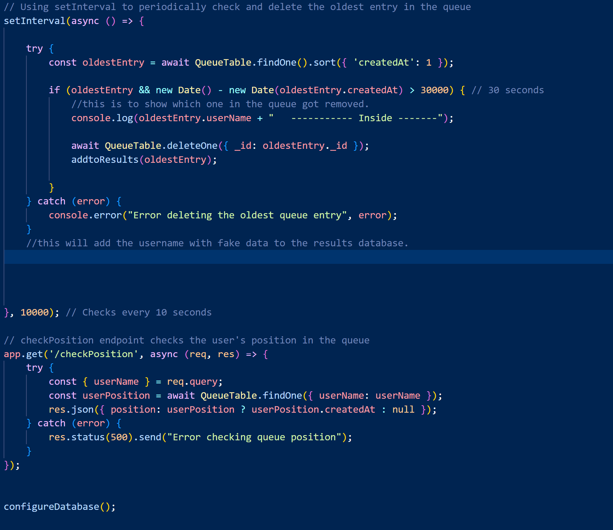

# Welcome to my Github Portfolio!
## Hello! I'm Trace Erickson
I am a Software Engineer and recent graduate of Weber State University with a B.S. In Computer Science. Welcome to my GitHub portfolio. Here, you'll find a collection of projects that showcase my skills, interests, and my journey in the world of coding and technology.

### About Me
**Background:** 
After graduating high school, I decided to pursue a career in software development.

**Education:** 
- B.S. Computer Science, Weber State University (2023)
- A.A.S. Computer Science, Weber State University (2022)
- A.S. General Science, Weber State University (2021)

**Professional Interests:** 
My professional interests include front-end web development, embedded systems programming, and A.I.

**Contact:** 
- Email: 19terickson@gmail.com 
- LinkedIn: [Trace Erickson](https://www.linkedin.com/in/trace-erickson-191490233/)

## Projects
This portfolio contains various projects that I've worked on. Each project has its own directory with a detailed README explaining the project's purpose, technology stack, challenges faced, and learning outcomes.

### AlgoGauge
**Description:** AlgoGauge is an innovative web application designed to allow users to interactively test and measure the efficiency of various sorting algorithms. It incorporates a real-time queuing system, providing a platform where users can submit algorithm tasks and receive immediate feedback upon completion.

**Technologies Used:** Javascript, HTML, MERN-Stack Development (Mongo, Express, React, Node)

**Link to Project Folder:** [AlgoGaugeCapstone](https://github.com/19terickson/AlgoGaugeCapstone.git)

## AlgoGauge Description

[Your detailed project description here...]

### Interface Previews

#### Home Page

*The Home Page introduces users to the platform and guides them towards algorithm selection and testing.*

#### Metrics Page

*The Metrics Page displays user performance metrics and results.*

#### Queue System

*The Queue Modal shows the user's position in the queue and updates in real-time.*

### Code Snippets

#### Queue Management

*This code snippet demonstrates the queue management system on the server side.*

#### User Position Tracking

*This snippet shows how the user's position in the queue is tracked and updated.*

*More details and screenshots of this project can be found under the 'AlgoGauge' folder within this repository.*

### Utah Parks Explorer
**Description:** Utah Parks Explorer is a website that offers extensive information about Utah's national parks: Zion, Bryce Canyon, Capitol Reef, Arches, and Canyonlands. This website will not only detail the unique features of each park but also provide practical information such as maps, trails, accommodations, and visitor guidelines.

**Technologies Used:** Javascript, HTML, Python, Python Django

**Link to Project Folder:** [Utah Parks Explorer](https://github.com/19terickson/utah-parks-explorer.git)

*More details and screenshots of this project can be found under the 'Utah Parks Explorer' folder within this repository.*

---

I'm always open to collaborating on interesting projects. Feel free to reach out if you have an idea or a project in mind!

## Acknowledgements
Special thank you to Brad Peterson, Jaron Montano, Hunter Ferrin, and Blake Thomas.

Thank you for visiting my portfolio. Feel free to explore my projects and reach out if you have questions or want to connect!
